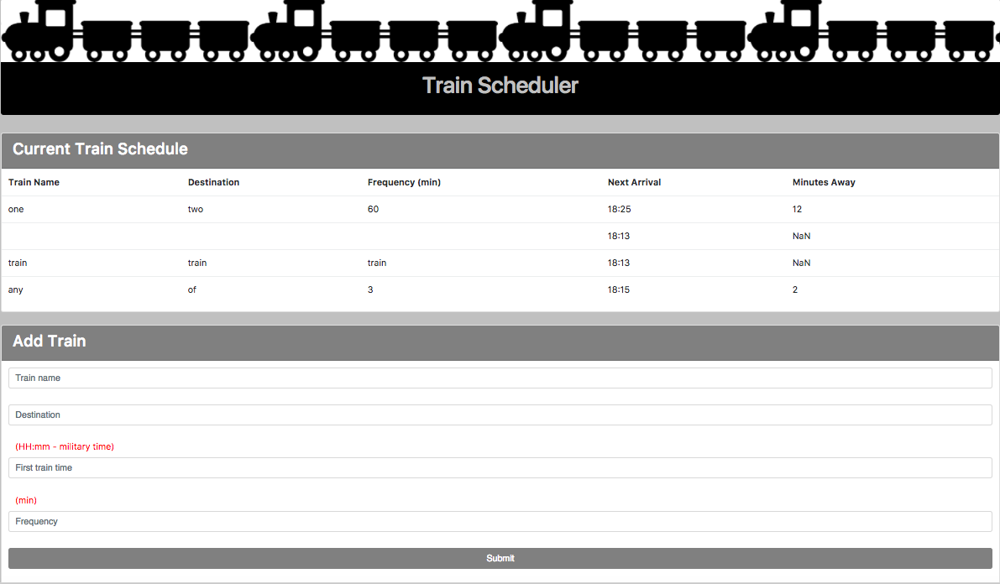
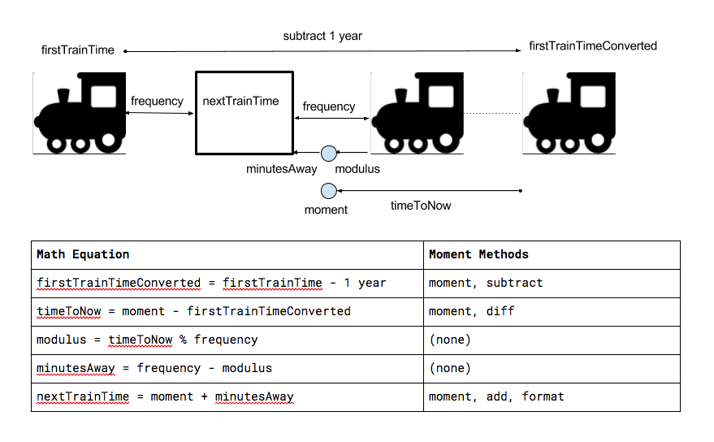

# Train-Scheduler
Firebase Assignment

### Logic
* I created the drawing below (using Google Docs), to illustrate the variables of logic.js.
* Below the illustration, I created a table to collect/track the moment methods and to correspond math equations with those required moment methods.
